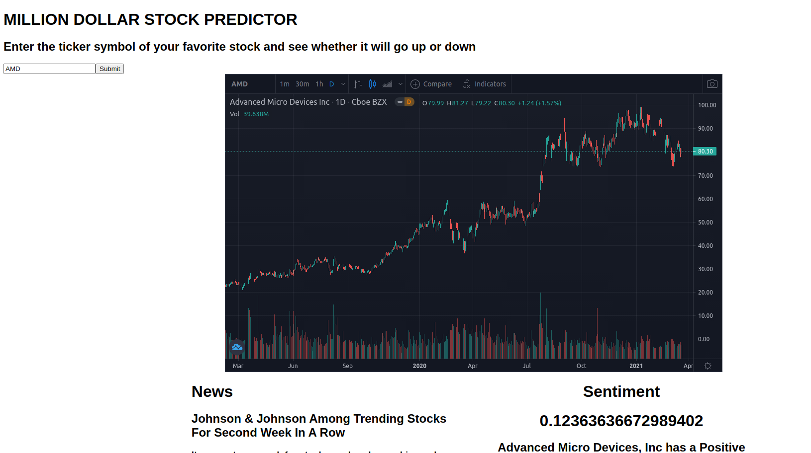

# TA Trader Dashboard

There are three main parts to the TA Trader Dashboard. The first part is a series of python scripts that use a combination of web scraping and api requests to collect financial data and store it to a PostgreSQL database. The scripts are executed using cronjob and the database is updated periodically. The scripts look for news about stocks that can potentially cause a significant price shift such as earnings reports, news of mergers & acquisitions, publically reported insider trading, politician buys and sells, and new ratings. They look for news that breaks before market open or after market close. Then they takes the most significant news events and determine a sentiment score for the stock by taking all recent news articles about stock queried from the News api and sending them to the Google Cloud Language api. This helps determine if many people feel strongly about the stock.

The second part of the TA Trader Dashboard are the trading bots. They are Python bots that connect to the Alpace Trade Api. Alpaca is a broker that provides a public api for account holders to perform actions on their account. the bots can get stock price data down to the minute, check current portfolio holdings, and place buy, sell, or close signals to open or close positions on stocks. Some of the bots use simple technical analysis while looping through universes of stocks looking for technical setups to indicate signals to open or close positions. Some of them use news data gathered by the data scripts. Some use a combination of both. They use the stocks detected by news sentiment to get the initial universe of stocks to trade, and then look for technical setups on those stocks to initiate a trade.

The last part of the TA Trader Dashboard is the frontend web app that displays data about the app. The Home page displays all the tables of data gathered in the database. The Search page allows the user to enter a stock ticker and search for data about that stock. The search feature uses many of the same methods as the data scripts. It will search the News Api, calcluate sentiment, search for any news of earnings reports, insider trading, ratings, or any other information that might be used make trading decisions about the stock.

 
 

# Instructions on setting up ec2 instance for data-scripts and bots.

Create new instance and ssh into it.  

 

----- install git, get rando-trader, set date -----  

Install git:  sudo apt-get install git

git clone https://github.com/rando-mane/rando-trader.git && cd rando-trader

sudo timedatectl set-timezone America/Los_Angeles

copy over all config, credentials, and env files  

 
 

----- Get distutils and pip and install all requirements -----  

curl https://bootstrap.pypa.io/get-pip.py -o get-pip.py

sudo apt-get install python3-distutils

python3 get-pip.py

export PATH="$PATH:/home/ubuntu/.local/bin"

source ~/.profile

pip3 install -r requirements.txt  

 
 

----- install chrome, chromedriver -----  

wget https://dl.google.com/linux/direct/google-chrome-stable_current_amd64.deb

sudo apt install ./google-chrome-stable_current_amd64.deb

sudo wget https://chromedriver.storage.googleapis.com/90.0.4430.24/chromedriver_linux64.zip

sudo apt install unzip

sudo unzip chromedriver_linux64.zip

sudo mv chromedriver /usr/bin/chromedriver  

 
 

----- install talib -----

sudo apt update

sudo apt install build-essential

sudo apt-get install manpages-dev

gcc --version

unzip mrjbq7-ta-lib-TA_Lib-0.4.20-0-g95b4f80.zip

cd mrjbq7-ta-lib-95b4f80

sudo apt-get install python3-dev

sudo python3 setup.py install

 
 

----- setup cronjob -----

sudo service cron start

crontab -e  

\# GET LATEST INSIDER BUYS AND APPEND TO INSIDER_TRADING TABLE 
0 1 * * * cd ~/rando-trader/data-scripts && python3 insider_trading.py 

\# GET ALL CURRENT DATA FROM ALL QUIVER QUANT API ENDPOINTS AND UPDATE CORRESPONDING TABLES 
5 1 * * * cd ~/rando-trader/data-scripts && python3 get_quiver_data.py 

\# GET ALL STOCKS WITH THE HIGHEST SHORT INTEREST 
10 1 * * * cd ~rando-trader/data-scripts && python3 short_interest.py 

\# GET AM EARNINGS IN THE MORNING, GET PM EARNINGS IN THE AFTERNOON, GET EARNINGS SENTIMENT SHORTLY BEFORE MARKET CLOSE 
25 6 * * 1-5 cd ~/rando-trader/data-scripts/earnings && python3 morning_earnings.py 
0 17 * * 1-5 cd ~/rando-trader/data-scripts/earnings && python3 after_market_earnings.py 
55 12 * * 1-5 cd ~/rando-trader/data-scripts/earnings && export GOOGLE_APPLICATION_CREDENTIALS=credentials.json && python3 earnings_sentiment.py 

\# GET ALL TICKERS WITH M&A ANNOUNCEMENTS, PASS EACH TO SENTIMENTY.PY AND STORE RESULTS TO MA_SENTIMENT TABLE 
0 8 * * * cd ~/rando-trader/data-scripts/ma && export GOOGLE_APPLICATION_CREDENTIALS=credentials.json && python3 ma.py 

\# GET ALL TICKERS WITH ANALYST UPGRAGES OR DOWNGRADES FOR THE CURRENT DAY 
10 8 * * * cd ~/rando-trader/data-scripts/ratings && export GOOGLE_APPLICATION_CREDENTIALS=credentials.json && python3 ratings.py 

\# GET PREMARKET GAINERS, LOSERS, AND MOST ACTIVE 
20 6 * * 1-5 cd ~/rando-trader/data-scripts/premarket-movers && python3 premarket_movers.py 
21 6 * * 1-5 cd ~/rando-trader/data-scripts/premarket-movers && python3 most_active.py 
22 6 * * 1-5 cd ~/rando-trader/data-scripts/premarket-movers && export GOOGLE_APPLICATION_CREDENTIALS=credentials.json && python3 premarket_sentiment.py 

\# STOCK UNIVERSES 
00 2 * * 1-5 cd ~/rando-trader/data-scripts/screeners && python3 broad_universe.py 
10 2 * * 1-5 cd ~/rando-trader/data-scripts/screeners && python3 heavily_traded.py.py 
20 2 * * 1-5 cd ~/rando-trader/data-scripts/screeners && python3 high_rvol.py.py 
30 2 * * 1-5 cd ~/rando-trader/data-scripts/screeners && python3 high_score.py.py 

 
 
 
 

# Instructions on setting up ec2 instance for sentiment-api

 

----- commands to run a production flask server -----

export FLASK_APP=index.py

export FLASK_ENV=development

flask run

 
 

# Instructions on setting up ec2 instance for data-api

 

----- install node/npm, dependancies -----

curl -o- https://raw.githubusercontent.com/nvm-sh/nvm/v0.38.0/install.sh | bash

RESTART TERMINAL

nvm install node

cd ~/rando-trader/data-api

npm i

node index.js

 
 

# Instructions on setting up Digital Ocean instance for server and dashboard.

curl -o- https://raw.githubusercontent.com/nvm-sh/nvm/v0.38.0/install.sh | bash

RESTART TERMINAL

nvm install node

cd ~/rando-trader/dashboard

npm i

npm run build

cd ~/rando-trader/server

npm i

node index.js

